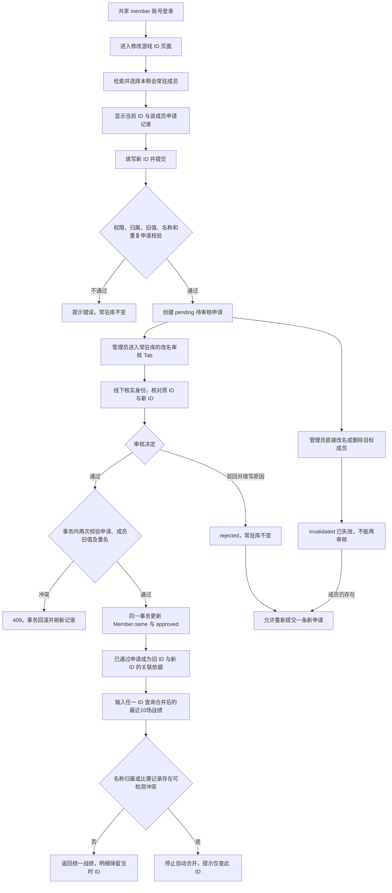

# 帮众修改游戏 ID：设计评审稿

## 1. 已确认范围与现状

用户已确认：
- 继续使用共享 member 账号，选择本帮会常驻成员代填申请；管理员通过游戏或群内沟通核实身份。
- 审核通过后仅改写常驻库名称，不回写已有出勤、排表、录屏、比赛数据。
- 追加确认：个人战绩支持新旧 ID 合并查询，连续多次改名也保留关联；仍展示跨全部关联 ID 的最近 10 场，不扩大为无限历史查询。
- 追加确认：发现名称归属冲突时停止自动合并，保留显式“仅查此 ID”模式；不限制管理员现有成员维护，不引入旧 ID 永久占用或按实际改名时间划分身份的流程。

代码核实：
- `backend/app/models/user.py` 没有个人成员绑定；不能技术性保证“仅本人申请”。申请人字段代表提交账号，不代表实际操作的自然人。
- 游戏 ID 对应 `Member.name`，数据库主键 `Member.id` 不变。不能新增另一个游戏 ID 字段形成双重来源。
- 当前不存在 `frontend/src/views/member/MemberProfile.vue`。已有个人战绩页是按名称自由查询，不具有身份认证能力。
- 当前个人战绩按 `match_data.player_name` 精确匹配，常驻成员详情也调用同一接口；本次将两处统一为默认合并已确认的新旧 ID。
- `match_data` 没有游戏账号唯一标识或 member_id，不能凭名字/职业/审批时间准确区分未登记的历史同名玩家；只对可检测的冲突停止合并，不承诺自动识别全部历史复用。
- `require_admin` 包含 developer；本功能审核必须使用严格 admin 校验，不能直接复用其宽泛语义。
- 常驻成员目前没有帮会内名称唯一约束；本期不清洗历史重名，不改变既有管理员 CRUD/Excel 的整体重名政策。

不包含：个人账号体系、自动验证游戏身份、批量审核、撤销已审核结果、申请撤回/编辑、消息推送、历史赛程名称同步、历史原始数据改写、逐场身份人工归属工具及上线前未登记改名的自动推断。

## 2. 业务流程



### 2.1 状态与业务规则

- `pending`：待审核，未影响常驻库。
- `approved`：管理员审核通过，成员名称已在同一事务中更新。
- `rejected`：管理员驳回，必须填写原因。
- `invalidated`：成员在待审期间被直接改名或删除，由业务联动自动失效；不是一次管理员审核，不伪造审核人。
- 一名常驻成员同时最多存在一条 pending，限制按成员而非共享账号计算，不能阻止其他成员申请。
- 终态不可再次审核或改写原申请；重新申请创建新记录，保留审计轨迹。
- 名称输入去除首尾空白后按 Unicode 码点计数，长度 1～32；拒绝换行和控制字符。保留合法中文和游戏允许的符号，不做大小写折叠或全半角归并。
- 新 ID 不得等于当前 ID，不得与本帮会其他常驻成员当前名称精确相同；跨帮会同名允许。
- 待审核的新 ID 不作为名称占用。不同成员申请同一新 ID 可以并存，但审核时只有未发生重名的一方能通过。
- 现有成员同名时，候选项增加主职业、正式/替补及成员编号辅助区分，提交始终使用 `member_id`。
- 身份核实由管理员负责；前端确认勾选只记录管理员确认意图，不作为游戏身份已被技术验证的证明。

### 2.2 数据影响

| 数据 | 处理 |
|---|---|
| `members.name` | 通过时更新 |
| `members.id`、职业、状态、备注 | 不变 |
| 已有出勤、排表 JSON、录屏名字快照 | 不回写，含尚未结束的赛程 |
| `match_data.player_name`、分析调整、战报 | 不回写 |
| 后续从常驻库新导入的成员 | 使用届时常驻库中的新名称 |
| 个人战绩、成员详情中的战绩 | 输入任一关联 ID，默认合并最近10场；保留精确查询入口 |

### 2.3 新旧 ID 合并查询

关联来源及规则：
- 不再新增别名表，直接以 `member_game_id_requests` 中 approved 记录的 member_id、old_game_id、new_game_id 作为已确认历史关系，当前名称以 Member.name 为准。
- 输入 ID 先在当前帮会内匹配当前成员名称或已通过申请的任一端，定位唯一存续 member_id；然后取该成员当前名称与全部 approved 原/新 ID，去重组成查询集合。必须按 member_id 归组，不能按相同名字把不同成员的关系链串在一起。
- `甲 → 乙 → 丙` 后输入甲、乙、丙均返回相同的合并结果；改回旧 ID 也只保留一份名称，不因关系环路重复统计。
- pending/rejected/invalidated 不产生别名关系；通过事务提交后，下次查询立即生效，不增加异步同步任务或长期别名缓存。
- 管理员直接编辑未记录在 approved 申请中的旧名，不追溯生成历史别名；成员当前名称仍可关联到其已经确认的历史名称。上线前未登记的改名不自动补录。
- 原先存在的旧 ID 比赛数据无需迁移；只要旧名在本次已确认关系中，即可参与查询。不能将 reviewed_at 当成游戏实际改名时间切分战绩。

冲突判定与退路：
- 输入名或集合内任一名称关联到另一个当前成员/另一个成员的 approved 记录，返回409，不取第一条、不优先“当前名”、不只合并无冲突的一部分。
- approved 记录 member_id 已置空时保留为历史占用线索；涉及这些名称的自动归属不再可信，返回409，避免删人重建或主键复用导致重新关联。
- 本帮会比赛数据中，同一 `schedule_id + round_no` 若命中多个关联名称或多个阵营，视为存在歧义，返回409。先对候选名称的完整本帮会数据做冲突检测，再取最近10场，不能因 LIMIT 遗漏冲突证据。
- `merge_aliases=false` 明确退回原始按名称精确查询；此结果标注“按记录 ID 查询，未确认个人归属”，不把重名混合结果宣称为某成员的准确战绩。
- 没有任何已登记关系且没有当前成员冲突时，保留原先精确查询和空结果行为，支持非常驻玩家。
- 冲突检查只能识别系统已记录的证据。未登记的跨时期同名复用无法仅凭 CSV 自动发现；页面说明此限制，后续如需完全区分须另建实际生效时间或逐场身份确认方案。

统计实现：
- 先对别名集合联合筛选，再按比赛时间倒序、赛程编号倒序取最近10个不同赛程；不能对每个 ID 各取10场后拼接。
- 用名称集合过滤原始 MatchData，不直接联查一对多申请记录扩增行数；同一个 MatchData.id 最多计入一次。
- 概览、趋势、单局明细使用同一结果集。每条明细保留原始 player_name 和 camp；排名、阵营分母仍使用该局完整比赛记录，不因合并而合并阵营或改变公式。
- 合并结果以当前 ID 展示标题，同时列出本次关联的历史 ID；精确模式以查询 ID 展示，不冒认成员身份。

## 3. 数据库变更方案

新增 `member_game_id_requests`。以下为评审字段清单，落盘时完整表结构仅维护于 `memory-bank/database-design.md` 的新增章节，专项设计文档使用摘要与链接引用。

| 字段 | 类型与空值 | 用途 |
|---|---|---|
| `id` | INTEGER PK | 申请主键 |
| `guild_id` | INTEGER NOT NULL，FK guilds | 从认证上下文确定的所属帮会 |
| `member_id` | INTEGER NULL，FK members | 提交时必须存在；成员删除后置空，避免主键复用误关联 |
| `old_game_id` | String(32) NOT NULL | 提交时从成员表读取的原 ID 快照 |
| `new_game_id` | String(32) NOT NULL | 校验后的目标 ID |
| `requester_id` | INTEGER NULL，FK users | 提交账号；账号删除后置空 |
| `requester_username` | String(64) NOT NULL | 提交账号名快照，管理员可见 |
| `status` | String(16) NOT NULL，默认 pending | 四种状态 |
| `reviewer_id` | INTEGER NULL，FK users | 审核管理员；账号删除后置空 |
| `reviewer_username` | String(64) NULL | 审核账号名快照，管理员可见 |
| `review_remark` | String(255) NULL | 审核意见，驳回时非空，帮众可见 |
| `invalidated_reason` | String(32) NULL | `member_renamed` / `member_deleted` |
| `created_at` | DATETIME NOT NULL | 申请时间 |
| `reviewed_at` | DATETIME NULL | 人工审核时间 |
| `updated_at` | DATETIME NOT NULL | 审核或自动失效时间 |

约束与索引：
- 状态使用 CHECK 白名单；数据库层限制新 ID 长度，应用层完成规范化及字符校验。
- pending 必须有 `member_id`，且没有审核时间；人工审核终态必须有审核时间及审核账号名快照，不能要求 reviewer_id 永久非空。
- 部分唯一索引：`UNIQUE(guild_id, member_id) WHERE status = 'pending'`，数据库兜底并发重复提交。
- 查询索引：`(guild_id, status, created_at, id)`、`(guild_id, member_id, created_at, id)`；账号引用字段建立索引，支持删除账号时处理关联。
- 合并战绩新增索引：`(guild_id, old_game_id)`、`(guild_id, new_game_id)` 的 approved 部分索引，支持输入任一名称定位关系及冲突检测。批准记录长期作为历史名称来源，不因常规操作日志保留期而清理。
- 此扩展不新增第二张别名表，也不向 MatchData 写入 member_id 或改写 player_name；仍使用本次同一迁移创建申请表和相关索引。
- 不给 `members` 新增全局唯一约束，不回填或覆盖任何历史成员名称。

### 3.1 迁移

- 新增 `backend/alembic/versions/o9p0q1r2s3t4_add_member_game_id_requests.py`，接续当前 head `n8o9p0q1r2s3`；执行前再次核对迁移头，避免其他并行改动产生双 head。
- 新表在创建时一次定义 FK/CHECK，再创建索引；不修改历史 migration，不使用 SQLite 不支持的直接追加约束方案。
- 模型导入登记到 `backend/app/models/__init__.py`；现有 Alembic env 会自动加载元数据。
- downgrade 只撤销新增表和索引，不尝试自动撤销已经生效的改名；生产回退前必须备份申请记录。
- 本轮只设计，不运行迁移；后续验证使用隔离测试库，不接触业务库。

### 3.2 删除及直接编辑联动

沿用项目应用层维护关联的方式，不依赖当前未显式启用的 SQLite 外键级联：
- 管理员直接修改成员名称：同一事务将该成员 pending 申请标记 invalidated；只改职业/备注不触发。审批成功路径不调用会单独 commit 的既有 `update_member`。
- 单个/批量删除成员：先将 pending 标记失效，再将该成员全部申请的 member_id 置空，保留名称快照和审核记录。
- 删除账号：先将申请人/审核人引用置空，保留账号名快照；不因共享账号被删除而丢失待审申请。
- 删除整个帮会：在删除成员和账号前删除该帮会的申请记录，遵循现有整帮会删除语义；不影响其他帮会。
- 以上辅助函数不得自行 commit，由原业务操作统一提交或回滚。

## 4. API 定义

统一前缀 `/api/v1`。使用新路由模块，保持既有 `/members` 的 CRUD 权限不变。

| 方法与路径 | 权限 | 参数与返回 |
|---|---|---|
| `GET /members/game-id-options` | member | `q` 可选、最长32；`page`≥1、`page_size`1～50，默认20；返回本帮会最小成员候选分页 |
| `POST /members/{member_id}/game-id-requests` | member | 提交申请；成功201 |
| `GET /members/{member_id}/game-id-requests` | member、admin | 该成员申请历史分页；member 使用脱敏输出模型 |
| `GET /members/game-id-requests` | admin | 帮会审核列表；status 默认 pending，可选 all；可按 member_id、原/新 ID 关键词筛选；分页默认20，上限100 |
| `PUT /members/game-id-requests/{request_id}/audit` | admin | 通过/驳回；成功200，重复或冲突409 |
| `GET /my-stats`（扩展） | member、admin | 保留 player_name；新增 merge_aliases，默认true；返回统一战绩与查询身份说明 |
| `GET /my-stats/player-names`（扩展） | member、admin | 保留 q 和 names:string[] 合同；补充关联的当前/历史名称候选 |

所有路径 ID 必须为正整数。分页记录统一按 `created_at DESC, id DESC` 稳定排序。

### 4.1 候选成员与历史读取

候选响应：
```json
{
  "items": [{"id": 123, "name": "原游戏ID", "main_profession": "神相", "status": "formal"}],
  "total": 1,
  "page": 1,
  "page_size": 20
}
```
不返回常驻备注、完整成员档案或账号信息。不复用管理员专用的成员列表接口以免扩大权限。

帮众历史返回 `items/total/page/page_size` 和所选成员的最小当前信息。每条记录仅包含申请编号、member_id、原/新 ID、状态、审核意见、失效原因、创建/审核/更新时间。管理员列表额外返回申请人/审核人账号快照和当前成员名称。

共享账号下，同帮会帮众能够查看所选成员的改名记录及驳回原因。这不是个人私密空间，不提供“只看我的申请”的虚假隔离；审核意见提示不要填写隐私信息。

### 4.2 提交

```json
{
  "expected_old_game_id": "原游戏ID",
  "new_game_id": "新游戏ID"
}
```

- `expected_old_game_id` 仅用于校验页面是否过期；真正存储的 old_game_id 必须从数据库读取。
- requester、guild、初始状态、时间全部由服务器产生。
- 请求模型禁止额外字段，拒绝客户端夹带 guild_id、requester_id、reviewer_id、status 等字段。
- 成功返回新申请的帮众输出模型，状态 pending，不改变常驻库。

### 4.3 审核

通过：
```json
{"action": "approve", "identity_confirmed": true, "review_remark": null}
```

驳回：
```json
{"action": "reject", "review_remark": "请核实原 ID 后重新提交"}
```

- action 仅允许 approve/reject；approve 要求 identity_confirmed 为 true，reject 要求去空白后审核意见长度1～255。
- 管理员不能在审核接口临时改写目标 ID；内容有误时驳回，让帮众重新申请。
- 成功返回管理员申请模型，包含审批后当前成员名称；前端据此刷新列表。

### 4.4 错误合同

沿用 `{code, message, data: null}`，不改全站 HTTP 封装。

| HTTP | 情况 |
|---|---|
| 401 | 未登录、Token 无效、账号禁用 |
| 403 | 非指定角色、账号未绑定有效帮会 |
| 404 | 目标成员/申请不存在或不属于当前帮会，统一隐藏外帮会资源存在性 |
| 409 | 已有待审申请、页面旧 ID 已过期、新 ID 被占用、申请已处理/失效、并发状态冲突；个人战绩合并时检测到名称/比赛归属冲突 |
| 422 | 空白/超长/非法输入、新旧 ID 相同、审核参数缺失或多余字段 |
| 503 | SQLite 写锁等待后仍繁忙；事务回滚，提示稍后刷新重试，不泄露数据库错误 |

新业务异常注册至现有统一异常响应；仅映射已识别的约束冲突及 SQLite busy 错误，不能把所有数据库异常都伪装成409。

### 4.5 个人战绩查询扩展合同

- 请求示例：`GET /api/v1/my-stats?player_name=原游戏ID&merge_aliases=true`；显式精确查询使用 `merge_aliases=false`。
- 保留原 `records` 与 `summary` 字段；新增 `identity`：`mode`（merged/exact）、`query_player_name`、`member_id`（可空）、`current_game_id`（可空）、`aliases:string[]`。
- 只有定位到唯一存续成员且具有 approved 改名关系、通过全部冲突校验时返回 merged；无已确认改名关系或显式精确查询返回 exact，member_id/current_game_id 置空，aliases 仅包含输入名。
- merged 时 summary.player_name 为成员当前 ID；records[].player_name 始终是比赛当时 ID。exact 时 summary.player_name 为输入名，不能标为唯一成员身份。
- 空战绩同样返回 identity，便于区分“已识别但无比赛数据”与“按原始 ID 未查到记录”。
- 查询解析、冲突检查、赛程和比赛筛选全部限定认证帮会；两个 my-stats 接口同步使用严格 member/admin 依赖并校验有效帮会，developer 不通过直接 API 读取本功能数据。
- 候选接口仍返回 names:string[]，数据源为原比赛名加存续成员 approved 关系中的旧/新名称及其当前名称。这样刚获批、尚无新 ID 比赛数据时，新 ID 也能提示。
- 候选按“精确输入优先、已有比赛记录数倒序、名称升序”排序，去重并保留10条上限；来自别名但无独立比赛记录的名称按0条排序。候选只提示字符串，真正查询时仍重新判断归属，不能把自动补全当作验证。
- 合并冲突继续使用统一409错误体，message 明确提示切换“仅查此 ID”；不悄悄改为精确结果伪装合并成功。

## 5. 事务、一致性与权限

### 5.1 提交一致性

- 路由从 JWT 解析当前有效用户；服务层再次验证角色、帮会和目标成员归属。
- 申请创建必须在单事务内绑定成员当前原值，使用带 guild/member/expected_name 条件的数据库写入，避免先读后写间隙接受已删除或已改名成员。
- 在该事务内校验新名称占用；部分唯一索引拦截同一成员的并发 pending。
- 并发失败完整 rollback；不留下重复申请，不改常驻库。

### 5.2 审核一致性

- 先以 `request_id + guild_id + status=pending` 条件原子更新申请，检查影响行数；这是事务内的暂时写入，不提前提交。
- 通过时，再以 `member_id + guild_id + name=old_game_id` 条件更新成员，并在同一写事务中检查本帮会其他成员是否占用新名称。任何一步失败，回滚申请状态与成员更新。
- 成员变更和审核人、审核时间、审核意见一次 commit；不能先审批成功再异步同步常驻库。
- 驳回只改变申请，不修改成员。
- 两名管理员并发处理同一申请，只允许一次成功；重放审核返回409，即使决定相同，也不能覆盖首位审核人。
- 不使用 SQLite 不提供实际行锁保障的 SELECT FOR UPDATE 作为防重复机制，不引入进程内锁作为数据库约束替代。
- 保持既有管理员直接编辑权。审核时检查名称占用，不宣称整个系统从此具有成员名称全局唯一保证。

### 5.3 权限落实

- 新增严格角色依赖：member 提交、admin 审核、member/admin 读取本功能相关记录；developer 对新功能接口一律403。
- 保留现有 require_admin 行为，避免影响其他模块。
- 所有数据范围取 current_user.guild_id；禁止 `body.guild_id or current_user.guild_id`。
- 请求归属与成员归属同时验证；申请记录本帮会但关联了外帮会成员的异常数据也不能通过。
- 共享账号身份不可证明属于已确认风险；前端隐藏按钮不替代后端鉴权。
- 申请表承担业务审计，现有写操作中间件记录接口调用。采用 `/members` 前缀，沿用 members 日志分类，不为此改写全站日志体系。

## 6. 前端交互

### 6.1 帮众

- 新增 `/game-id-change`，页面 `views/member/GameIdChangeView.vue`，仅 member 可进入。
- 侧边栏增加“修改游戏 ID”；账号下拉增加同名入口。保留登录默认页不变。
- 页面：共享账号与历史数据提示 → 常驻成员检索选择 → 当前 ID 只读 → 新 ID → “提交申请” → 所选成员申请记录。
- 未选择成员时提示先选择；不把个人战绩搜索框或 localStorage 中的名称当作本人身份。
- 提交前展示“原 ID → 新 ID”，提示审核后更新常驻库并支持新旧 ID 战绩合并查询，但不改写历史记录；发现归属冲突时不自动合并。提交中禁用重复操作。
- 有 pending 时显示原/新 ID 和提交时间，禁用再次提交并说明原因。
- 成功后保留所选成员、清空新 ID，刷新历史；审批通过后刷新当前成员名称。
- 记录通过手动刷新、页面进入及提交后更新，不新增轮询/推送。
- 请求失败保留输入；超时先刷新历史确认是否已经提交成功，避免无提示重复申请。
- 快速切换成员/搜索词时采用请求序号，丢弃过期响应。

### 6.2 管理员

- 在 `MemberListView.vue` 新增“改名审核”Tab，直达地址 `/members?tab=game-id-requests`；只对严格 admin 显示。
- 默认展示待审核；支持全部/已通过/已驳回/已失效筛选、关键词检索和分页。
- 展示原 ID、新 ID、当前成员名称、申请时间、提交账号；审核详情展示历史意见和审核人。
- 通过前弹窗要求确认已核实身份，明确“更新常驻库并建立新旧 ID 查询关联，历史记录原文不变”；同时提示名称归属冲突将停止合并，审批成功不等于历史身份已完全消歧。驳回弹窗原因必填。
- 每条审核独立 submitting 状态，不用乐观更新伪造成功；409时刷新当前记录，保留必要的错误说明。
- 成功刷新审核列表和常驻库数据；当前筛选最后一条消失时修正分页。
- 与现有 Tab URL 同步逻辑兼容，支持刷新、前进/后退和直接打开链接。

### 6.3 视觉与可访问性

按已读取的 finesse-ui 产品/审核流程参考执行，沿用本项目 `ui-style-guide.md` 和既有 theme.css，不新增主题、图库或动效库。
- 桌面为紧凑表格；≤768px 使用行列表，原/新 ID 清晰分行，状态文字可读。
- 复用 SkeletonTable、EmptyState、现有分页与表单组件；空列表、无搜索结果和加载失败分别呈现。
- 覆盖默认、hover、focus、disabled、loading、error、empty、success 状态；状态不能只靠颜色区分。
- 长 ID 可换行/查看全文；操作按钮文字不换行；移动端审核控件具有足够触控区域。
- 不新增个人中心大页面，不改变既有导航结构或管理员常驻库其他功能。
- 交付时做 finesse-ui 静态 pre-flight 与 cheapness 检查；浏览器操作只在用户明确要求后执行，不把静态检查说成视觉验收。

### 6.4 个人战绩与成员详情

- 个人战绩搜索提示“输入当前或历史游戏 ID”；默认启用“合并历史 ID”，同时提供“仅查此 ID”切换。
- 合并成功时展示当前 ID、输入 ID 和关联历史 ID，并明确“合并后的最近10场”；各场明细的赛程单元格补充当场 ID，移动端同样可见，不强行新增多列表格。
- 合并冲突、网络失败、真正无数据分开显示；冲突时不显示旧查询结果，不伪装为“未找到比赛数据”，提供显式精确查询操作及归属未确认提示。
- 成员详情也默认合并查询，但成员基本信息/出勤率与战绩错误状态分离。战绩409不能令整个页面误报“成员不存在或已删除”。
- 成员详情遇到冲突时只显示战绩冲突提示和“前往个人战绩按 ID 查询”；不在成员档案里直接展示未消歧的精确结果冒认个人归属。跳转携带 player_name 与 merge_aliases=false，个人战绩页读取参数后执行显式精确查询。
- 搜索和模式切换使用请求序号丢弃旧响应；历史搜索标签仍保存实际输入 ID，由后端重新解析关系，不能将浏览器缓存当作归属依据。
- 当前桌面工具栏的辅助文字在移动端会隐藏；新增关联说明使用独立可换行信息区，移动端不能隐藏改名关联和冲突告知。

## 7. 实现文件边界

### 后端新增
- `app/models/game_id_request.py`：申请模型。
- `app/schemas/game_id_request.py`：提交、审核、候选及分角色响应。
- `app/services/game_id_request_service.py`：查询、提交、原子审核及业务异常。
- `app/services/game_id_request_lifecycle.py`：成员改名/删除、账号删除的关联维护；只依赖模型，不导入 member_service，不自行 commit，避免循环依赖。
- `app/api/v1/game_id_requests.py`：上述薄路由，统一 `/members` 前缀。
- `app/services/player_identity_service.py`：批准记录名称解析、候选补全和冲突检查；身份解析使用 Member/申请模型，不反向依赖 my_stats_service，控制查询次数而非逐别名 N+1。
- `app/schemas/my_stats.py`：将现有 my_stats.py 路由内响应 Schema 原样移出并扩展 identity，保证扩展后路由仍≤150行。
- 新增迁移与 `scripts/selfcheck_game_id_requests.py`、`scripts/selfcheck_game_id_requests_concurrency.py`、`scripts/selfcheck_my_stats_aliases.py`。

### 后端修改
- `app/api/deps.py`：严格角色依赖。
- `app/api/v1/router.py`：新路由注册在 members.router 之前，避免 `/members/game-id-options` 和 `/members/game-id-requests` 被 `/{member_id}` 捕获。
- `app/models/__init__.py`、`app/main.py`：模型与异常登记。
- `member_service.py`、`account_service.py`、`guild_service.py`：仅增加本功能关联维护。
- `app/api/v1/my_stats.py`、`app/services/my_stats_service.py`：查询参数/权限/响应扩展，按别名联合选最近10场并保持指标与排名公式；移除“总查询固定3次”的过时说明，区分原统计查询与新增身份解析查询。
- 不扩充已超限的 members.py；不修改出勤/排表/录屏业务代码，不修改比赛 CSV 导入或指标公式。

### 前端新增与修改
- 新增 `api/gameIdRequests.ts`、`types/gameIdRequest.ts`。
- 新增 `views/member/GameIdChangeView.vue`。
- 新增 `components/members/GameIdRequestForm.vue`、`GameIdRequestHistory.vue`、`GameIdReviewPanel.vue`、`GameIdReviewDialog.vue`，按表单、记录与审核职责拆分。
- 修改 `router/index.ts`、`layouts/AppSidebar.vue`、`layouts/AppHeader.vue`、`views/members/MemberListView.vue`。
- 修改 `api/myStats.ts`、`types/myStats.ts`、`views/member/MyStatsView.vue`、`views/members/MemberDetailView.vue`、`components/my-stats/PlayerSearch.vue`：合并/精确查询切换、identity 展示及独立错误状态。
- 新增 `components/my-stats/StatsIdentityNotice.vue`，复用关联说明/冲突提示；`StatsMatchTable.vue` 仅在已有赛程单元格补当场 ID，并重评既有连续逻辑行数豁免，不扩展无关表格功能。
- Vue≤300行、服务≤300行、路由≤150行、工具≤200行，遵循 `.agent/rules/file-length-rule.md`。

## 8. 文档落盘与单一权威源

确认此设计后先完成文档，再写业务代码：

1. 新建 `memory-bank/design-game-id-change.md`：保存决策背景、流程图、API 合同、交互设计、技术实施与验收方案；引用 `../AGENTS.md` §2–§3、`ai-checklist.md` §五第14项及§六。
2. `database-design.md`：独家维护新表完整字段/约束/索引/生命周期规则。设计阶段标记“拟新增、尚未迁移”，不把未来结构算作已部署结构。
3. `design-document-v2.md`：补充功能列表、角色矩阵、帮众和管理员页面结构；明确共享账号代填及人工核实边界，更新个人战绩/成员详情为支持经确认的新旧 ID 合并查询。详细流程/API只链接专项设计，不重复维护。
   - `data-analysis-complete.md`：更新个人战绩名称关联口径，保持指标公式/单场分析不变，具体别名机制链接专项设计。
   - `stats-report-plan.md`：仅在现行成员详情说明补充对专项设计的引用，说明后续已扩展名称关联；其历史决策与实施记录原文保留。
4. `progress.md`：新增设计文档目录项，模块状态标为待实施，追加设计记录；仅在源码真正创建后更新代码目录树。实现完成后另记完成与验证结果。
5. `architecture.md`：同步目录树、专项文档说明、更新记录三处。
6. `AGENTS.md`：在文档职责表登记专项设计；现有产品/数据库/UI 权威归属保持不变。
7. 实现交付时同步 `backend/docs/README.md`、`frontend/docs/README.md` 及 `security-review.md` 的本功能安全决策与实测范围；引用 progress，不复制进度表。
8. 表数/迁移数只在相应权威源更新；受影响引用处优先改为引用。现有 progress 目录注释写13个迁移，实际14个，记录核实更正；完成本功能后才按实际新增结果统计。
9. 保留历史更新记录原文，保留文件行尾风格，检查 Markdown 链接和两份目录树。不创建额外根目录 task_plan/findings/progress 副本。

本轮设计评审稿由计划面板保存，尚未写入上述仓库文档；确认后落盘时按以上权威源划分内容，避免把整份评审稿再复制成多份可维护事实。

## 9. 验证方案

### 后端与安全

- 正常提交 pending：成员名称不变；通过后两表同时成功；驳回不改名且允许重新申请。
- 匿名、member/admin/developer 角色矩阵，禁用账号、无帮会账号、无效 Token。
- 跨帮会检索/历史/提交/审核，伪造 guild/requester/status 等额外字段，外帮会同名允许。
- 1/32/33字符、空白、控制字符、中文/符号、新旧相同、页面旧值过期、现有重名及目标名审核前被占用。
- 同一成员重复 pending；不同成员使用同一共享账号可分别提交。
- 两请求并发提交、两管理员并发通过/驳回、两成员竞争同一新 ID、审核与直接改名/删除并发。
- 通过事务故障注入：成员更新失败后申请仍为原状态，不能出现“已通过但未改名”。
- 直接改名使 pending 失效；普通职业/备注编辑不失效；单删/批删/删账号/删帮会关联处理不跨帮会。
- 审核重放不能覆盖首位审核人；账号删除后快照仍可展示；成员删除后不被后续复用主键重新关联。
- 审核前后对出勤、录屏、排表 JSON、比赛数据做逐项比较；历史原始数据完全不变，merge_aliases=false 的旧 ID 查询保持原口径。
- 合并战绩：甲→乙、甲→乙→丙、改回甲，任一 ID 返回相同的最近10场、概览与明细；重复别名不能放大行数，明细保留当场名称。
- 审批未通过前不关联，通过提交后立即关联；新 ID 尚无比赛记录也能提示并查询旧战绩；无改名历史、未知玩家、真正无数据保持正确响应。
- 跨名称总计超过10场时整体只取最近10场；场数按赛程去重，单局排名/阵营分母与原始数据计算一致，审批时间不裁剪补导的旧比赛。
- 冲突：当前重名、不同成员批准链重叠、冲突发生在集合中的非输入别名、删除成员留下的批准记录、同局多个名称/阵营、冲突只存在于最近10场之外，均不能静默合并；跨帮会同名不构成本帮会冲突。
- 显式精确查询不扩展别名；返回 mode=exact 且不冒认成员归属。冲突后UI能切换精确查询，成员详情基本信息仍显示。
- my-stats新增identity字段覆盖路由显式构造响应与空结果分支，避免服务返回字段被现有MyStatsResponse过滤丢失；候选接口去重、排序、上限与刚改名场景覆盖。
- 补充改名审批提交与查询交错的回归：每次查询只输出与其读取到的已提交批准记录一致的关联，不能使用尚未提交或已回滚的申请。
- 基础用例参照现有 unittest + 真实 JWT/ASGI selfcheck；并发用独立连接的隔离文件 SQLite，不用共享单连接内存库假装真实并发。
- 在隔离库验证空库升级、旧 head 升级、新增约束和回退；不运行业务库迁移或线上测试。

### 前端

- 后续实现可执行 `npm --prefix frontend run build` 验证类型与生产构建。
- 不自行运行 vitest；当前 package.json 没有 test 脚本或 vitest 依赖，不捏造现成测试命令、不为本功能擅自引入测试框架。
- 提供手工验收清单：帮众提交/待审/通过/驳回/失效、管理员确认/冲突刷新、移动端320/375/414/768宽度、超长ID、加载失败重试、键盘操作、刷新与路由前后退。
- 未获明确指示不打开浏览器，最终交付明确区分已跑检查与待用户视觉验收。

## 10. 参考与实施顺序

参考 GitHub 开源项目 [artscoop/django-approval](https://github.com/artscoop/django-approval)，已通过其 [DOCUMENTATION.md 镜像](https://cdn.jsdelivr.net/gh/artscoop/django-approval@master/DOCUMENTATION.md)核实：待审变更独立保存、批准后传播到原对象、默认保留审批资料。本项目只借鉴这些模式，不引入 Django 或通用审批引擎，不采用 staff 自动批准。

SQLite 部分索引及事务行为参考 [SQLAlchemy SQLite 官方文档](https://docs.sqlalchemy.org/en/20/dialects/sqlite.html#partial-indexes)，已通过 Context7 和官方页面核对。

执行顺序：设计确认 → memory-bank 文档落盘与索引同步 → 模型/迁移/服务及安全回归 → 前端申请与审核 → 构建和静态检查 → 文档状态与验证记录同步。未经用户允许不提交 Git、不删除仓库文件、不操作真实业务数据。