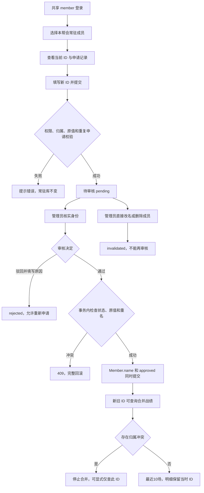

# 游戏 ID 改名申请与战绩关联设计

> 状态：设计确认并实施完成（2026-09-20）；实施与验证状态唯一来源：[progress.md](progress.md)。
> 规范依据：[AGENTS.md §2–§3](../AGENTS.md)、[ai-checklist.md §五第14项、§六](ai-checklist.md)。
> 功能与角色定义：[产品设计](design-document-v2.md#41-常驻库模块成员管理)；完整表结构与约束：[数据库设计 §2.12](database-design.md#212-member_game_id_requests--游戏-id-修改申请表)；视觉规范：[ui-style-guide.md](ui-style-guide.md)。

## 1. 背景与确认决策

帮众频繁改名导致常驻库维护困难。本次沿用共享 member 账号，选择本帮会成员代填，由管理员在游戏或群内核实身份。系统不能把共享登录账号等同于实际操作者，界面不使用“我的申请”或自动认领个人身份。

- 游戏 ID 对应 `members.name`，成员主键不变。
- 审核通过后仅改写常驻库，不回写已有赛程出勤、排表、录屏、CSV 比赛数据或战报。
- 个人战绩和成员详情支持输入已确认的新旧 ID，查询合并后的最近10场。
- 管理员直接在常驻库改名视为一次已确认改名：同一事务自动记录一条 approved 关联（操作管理员为提交/审核人快照，备注标注来源），个人战绩同样支持新旧合并（2026-09-20 追加确认）。
- 发现可检测的名称归属冲突时停止合并，保留“仅查此 ID”；不新增旧 ID 永久占用限制。
- 不包含：个人账号体系、自动验证游戏身份、批量审核、申请编辑/撤回、终态撤销、消息推送、上线前未登记改名的推断、逐场身份确认工具。

## 2. 业务流程



审核申请是独立于成员数据的待审变更。提交时不更新常驻库；审核时不能临时修改申请目标，内容错误应驳回后重新申请。完整状态、唯一性与删除联动规则只维护于数据库设计 §2.12。

## 3. 数据库与迁移方案

新增 `member_game_id_requests`，存储原/新 ID、目标成员、提交账号快照、状态、审核账号快照及时间；字段表、CHECK、部分唯一索引和生命周期详见数据库设计 §2.12，不在本文重复。

- 新迁移 `o9p0q1r2s3t4` 接续 `n8o9p0q1r2s3`，建表时一次定义约束。
- 不修改旧迁移，不清洗历史重名，不新增 members 全局唯一约束。
- 不新增第二张别名表，approved 申请兼作已确认的名称关系来源，不随普通操作日志保留期清理。
- downgrade 仅撤销新表和索引，不撤销已生效的成员改名；生产降级前须备份申请历史。
- ORM 模型登记到 `models/__init__.py`，现有 Alembic env 自动加载。

## 4. API 合同

统一前缀 `/api/v1`；成功响应沿用直接数据模型，错误沿用 `{code, message, data: null}`。

| 方法与路径 | 角色 | 输入/输出 |
|---|---|---|
| GET `/members/game-id-options` | member | q≤32，page≥1，page_size默认20/上限50；最小成员分页 |
| POST `/members/{member_id}/game-id-requests` | member | 新建申请，成功201 |
| GET `/members/{member_id}/game-id-requests` | member/admin | 成员当前信息及申请历史分页；page_size默认20/上限100 |
| GET `/members/game-id-requests` | admin | status默认pending，支持all；member_id/keyword筛选，分页默认20/上限100 |
| PUT `/members/game-id-requests/{request_id}/audit` | admin | approve/reject，成功200 |
| GET `/my-stats` | member/admin | player_name；merge_aliases默认true |
| GET `/my-stats/player-names` | member/admin | 保留q与names:string[]，补充新旧名称候选 |

所有路径 ID 为正整数。申请列表排序为 created_at DESC、id DESC。新静态路由在原 members.router 前注册，避免被 `/{member_id}` 捕获。

### 4.1 成员候选与历史

候选仅返回 `id/name/main_profession/status`，不开放原管理员成员列表，也不返回常驻备注或账号资料。

```json
{"items":[{"id":123,"name":"原游戏ID","main_profession":"神相","status":"formal"}],"total":1,"page":1,"page_size":20}
```

历史页返回 `member` 最小当前信息和 `items/total/page/page_size`。帮众可见申请编号、member_id、原/新 ID、状态、审核意见、失效原因和时间；管理员额外可见提交/审核账号快照及当前成员名称。

同帮会共享账号可查询所选成员的申请记录，审核意见不是个人私密信息，禁止在其中填写隐私资料。

### 4.2 提交与审核

提交：
```json
{"expected_old_game_id":"原游戏ID","new_game_id":"新游戏ID"}
```

expected_old_game_id 仅用于防页面过期；存储的旧值从数据库读取。新名称去首尾空白后按 Unicode 码点校验1～32，拒绝换行/控制字符，不做大小写或全半角归并。请求体禁止额外字段，不能指定 guild/requester/status/reviewer。

通过：
```json
{"action":"approve","identity_confirmed":true,"review_remark":null}
```

驳回：
```json
{"action":"reject","review_remark":"请核实原 ID 后重新提交"}
```

approve 必须显式确认身份，reject 必须有去空白后的1～255字符原因。身份确认仅代表管理员操作意图，不等于技术验证。

| HTTP | 情况 |
|---|---|
| 401 | 未登录、无效Token、禁用账号 |
| 403 | 角色不符或未绑定有效帮会 |
| 404 | 成员/申请不存在或不属于当前帮会，隐藏外帮会存在性 |
| 409 | 重复待审、旧值过期、名称占用、已处理、合并查询归属冲突 |
| 422 | 空白/超长/非法参数、额外字段、新旧名称相同 |
| 503 | SQLite锁等待后仍繁忙；回滚并提示稍后刷新 |

仅映射已识别的数据库冲突，不能把所有异常伪装为409。

### 4.3 战绩响应

保留 `records/summary`，新增：
```json
{"identity":{"mode":"merged","query_player_name":"原游戏ID","member_id":123,"current_game_id":"新游戏ID","aliases":["原游戏ID","新游戏ID"]}}
```

- 具有approved关系、唯一存续成员、全部冲突检查通过时为merged；summary.player_name为当前ID，records[].player_name保留当场原名。
- 显式 `merge_aliases=false` 或无已确认关系时为exact；member_id/current_game_id为空，aliases仅输入名，标题使用输入名。
- 空结果也返回identity；合并冲突返回409，不偷偷切换为精确查询。
- 自动补全数据源为原比赛名与存续成员approved关系的旧/新名及当前名。精确输入优先，再按原始记录数倒序、名称升序，去重后最多10条。

## 5. 战绩关联算法与边界

1. 在认证帮会内按输入名查当前成员及approved申请两端，定位唯一存续member_id。
2. 取该成员当前名和全部approved原/新名，去重。必须按member_id归组，不能通过同名连接不同成员。
3. 检查集合任一名称是否属于其他当前成员/其他成员approved记录，或存在member_id已置空的批准记录；有则409。
4. 检查本帮会全部候选比赛，同一schedule_id+round_no命中多个名字或阵营则409；不能先LIMIT10再检测冲突。
5. 联合名称集合选最近10个不同赛程，比赛时间倒序、赛程编号倒序；再查询对应明细，禁止每个名字各取10场拼接。
6. 不直接联查一对多申请表扩增比赛行，同一MatchData.id最多计一次；原单局全量数据仍用于排名与阵营分母。

连续甲→乙→丙或改回甲，输入任一已确认ID得到相同结果。待审/驳回/失效不关联，审批提交后生效，不新增异步任务或长期别名缓存。

管理员直接在常驻库改名（`PUT /members/{id}`）与审核通过同口径：同一事务失效待审申请并写入一条 approved 关联记录（提交/审核人=操作管理员，备注标注来源），下次查询立即生效。仍不补录上线前已发生、未登记的改名；审批时间不是游戏改名生效时间，不据此裁剪旧战绩。成员删除后批准记录保留为歧义证据，不自动绑定到新建成员。

“仅查此 ID”是原始名称查询，不保证结果属于一个自然人，界面明确提示。未登记的跨时期名字复用无法凭CSV全部识别；本期只处理可检测冲突，不承诺完整历史身份鉴定。

## 6. 权限、事务与生命周期

- member提交、admin审核；developer不能访问本功能新接口及扩展后的my-stats接口。
- 新增严格依赖，不修改包含developer的原require_admin。服务层复核有效帮会与成员/申请归属，归属只取认证上下文。
- 提交使用含guild/member/expected_name条件的写入，并由部分唯一索引拦截并发待审。
- 审核先对guild+request_id+pending做条件更新，再在同一写事务校验成员旧值/名称占用并更新成员；影响行数不符即回滚。
- 两表一次commit，不能调用已有会单独commit的update_member，也不能异步同步常驻库。重复审核409，不能覆盖首位审核人。
- 生命周期辅助函数不自行commit；管理员直接改名（失效待审 + 写入 approved 关联）与单删/批删/账号删除/整帮会删除规则见数据库设计。
- 申请表保留业务审计，已有中间件沿用members模块记录接口调用。不变更全站日志体系。

## 7. 前端交互

沿用浅色雅金主题、现有表单/骨架/空态/分页。桌面紧凑表格、≤768px行列表；无图片资源和新增动效库。

### 帮众

新增 `/game-id-change`，侧边栏及账号下拉入口，仅member可见。选择成员→当前ID只读→填写新ID→提交→查看所选成员记录。候选显示游戏 ID 与职业，不展示正式/替补状态；管理员侧保持原有显示。

有pending时禁用重复提交并解释原因。失败保留输入，超时先刷新记录确认是否已经提交成功。切换成员和搜索使用请求序号丢弃旧响应。页面进入、提交后和手动刷新更新状态，不轮询。

### 管理员

常驻库新增“改名审核”Tab，`/members?tab=game-id-requests`。默认待审，支持状态/关键词筛选及分页。通过前确认身份，驳回填写原因；每行独立提交态，失败不乐观更新。成功刷新审核和常驻库列表，修正空页。支持URL刷新及前进后退。

### 个人战绩与成员详情

默认合并历史ID，可显式仅查此ID。独立信息区展示当前/输入/历史名称及最近10场，移动端不隐藏。明细赛程单元格显示当场ID。

冲突、网络失败、无数据分别展示。成员详情基本信息和出勤率不受战绩409影响；冲突时跳转个人战绩并携带player_name、merge_aliases=false，不在档案里冒认精确结果身份。

完整覆盖默认/hover/focus/disabled/loading/error/empty/success；状态配文字，长ID可换行，按钮不换行，键盘焦点可见。

## 8. 文件与验证边界

后端新增申请model/schema/service/lifecycle/router、player_identity_service、my_stats schema、Alembic迁移和专项selfcheck。仅修改认证依赖、注册点、成员/账号/帮会生命周期与个人战绩查询。前端新增申请/审核组件与页面、StatsIdentityNotice，联动导航、路由及现有战绩组件。实际目录树只维护于progress.md。

验证：
- 真实JWT/ASGI隔离回归：角色/租户、参数边界、重复申请、审批、失效、删除关联、脱敏响应、事务故障回滚。
- 独立连接文件SQLite并发：重复提交、双管理员审核、同名竞争、直接改名/删除竞争。
- 别名回归：多次改名、改回旧名、审批前后、管理员直接改名自动关联、新名无数据、合并最近10场、非输入别名冲突、删除后冲突、旧赛程冲突、精确退路、指标/排名不变。
- 隔离库空库/旧head升级、约束及降级验证，业务库不迁移。
- 前端 `npm --prefix frontend run build`；不运行vitest，现有package.json没有测试脚本，不擅自引入框架。
- finesse-ui静态pre-flight；浏览器仅获明确指示后使用。手工验收320/375/414/768宽度、键盘、超长ID、错误重试、路由回退与模式切换。

## 9. 参考与文档职责

参考[artscoop/django-approval](https://github.com/artscoop/django-approval)：待审变更独立保存，批准后传播，保留审批资料。已查阅其[公开文档镜像](https://cdn.jsdelivr.net/gh/artscoop/django-approval@master/DOCUMENTATION.md)，不引入Django或自动审批。

SQLite部分索引参考[SQLAlchemy官方文档](https://docs.sqlalchemy.org/en/20/dialects/sqlite.html#partial-indexes)。

数据库事实维护在database-design；产品功能/权限在design-document-v2；API/交互/算法在本文；指标公式在data-analysis-complete；最终UI在ui-style-guide；进度与结果在progress；文档索引在architecture。历史记录保留原文。
